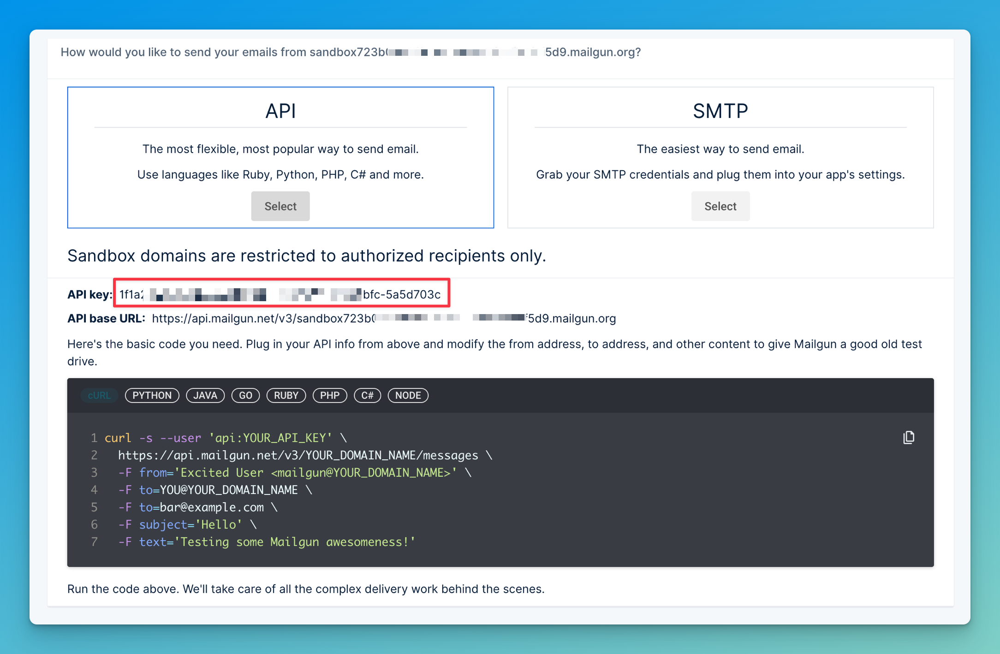

# How to send emails with Python and Mailgun

To send e-mails using Python, we are going to use Mailgun, a third party service which actually delivers the messages.

You could use [your own personal account and the built-in `email` and `smtp` libraries](https://blog.teclado.com/learn-python-send-emails/), but most personal e-mail providers will limit how many e-mails you can send per day. Plus, you won't get analytics and a host of other features that you can get with an email service like Mailgun.

There are two ways to use the Mailgun service: [via SMTP or via their API](https://www.mailgun.com/blog/email/difference-between-smtp-and-api/). I'll show you how to use the API since it's a bit easier and has the same functionality.

Sending an e-mail with Mailgun is just a matter of sending a request to their API. To do this, we'll use the `requests` library:

```bash
pip install requests
```

Remember to add it to your `requirements.txt` as well:

```text title="requirements.txt"
requests
```

## Setting up for Mailgun

Before we can send any emails, we need to set up our Mailgun account. First, register over at [https://mailgun.com](https://mailgun.com).

Once you have registered, select your sandbox domain. It's in [your dashboard](https://app.mailgun.com/app/dashboard), at the bottom. It looks like this: `sandbox847487f8g78.mailgun.org`. 

Then at the top right, enter your personal email address under "Authorized recipients".

You will get an email to confirm. Click the button that you see in that email to add your personal email to the list of authorized recipients.

Next up, grab your API key. You can find it by clicking on this button (my domain and API key are blurred in this screenshot):



## Sending emails with Mailgun

To make the API request which sends an email, we'll use a function that looks very much like this one (taken from their documentation):

```py
def send_simple_message():
    return requests.post(
        "https://api.mailgun.net/v3/YOUR_DOMAIN_NAME/messages",
        auth=("api", "YOUR_API_KEY"),
        data={"from": "Excited User <mailgun@YOUR_DOMAIN_NAME>",
            "to": ["bar@example.com", "YOU@YOUR_DOMAIN_NAME"],
            "subject": "Hello",
            "text": "Testing some Mailgun awesomness!"})
```

So let's go into our User resource and add a couple of imports and this function. Make sure to replace "Your Name" with your actual name or that of your application:

```py title="resources/user.py"
import os
import requests

...

def send_simple_message(to, subject, body):
    domain = os.getenv("MAILGUN_DOMAIN")
    return requests.post(
        f"https://api.mailgun.net/v3/{domain}/messages",
        auth=("api", os.getenv("MAILGUN_API_KEY")),
        data={
            "from": f"Your Name <mailgun@{domain}>",
            "to": [to],
            "subject": subject,
            "text": body,
        },
    )
```

Then let's go to the `.env` file and add your Mailgun API key and domain:

```text title=".env"
MAILGUN_API_KEY="1f1ahfjhf4878797887187j-5ac54n"
MAILGUN_DOMAIN="sandbox723b05d9.mailgun.org"
```

With this, we're ready to actually send emails!
